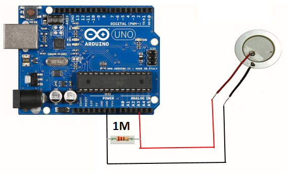

arduino-pro-micro-midi-device
=============================

### TODO
- [ ] piezo circuit
  - [Detect a Knock | Arduino Documentation](https://docs.arduino.cc/built-in-examples/sensors/Knock/#circuit)
  - Soldering

### Notes
- We do not know if ADC can capture full voltage range because we can press the piezo as hard as we can to exceed ADC reference voltage (e.g. 5V). Therefore, we do not care the maximum voltage, and allowing ADC to give clipped sampled ADC digital value (in arduino UNO we have 5V max in ADC which is 1023. >= 5V still gives 1023).
- We need flux to solder wires to piezo

### Tutorials
- [MIDIUSB - Arduino Reference](https://www.arduino.cc/reference/en/libraries/midiusb/)
  - [Arduino (Pro) micro as a USB-MIDI device (MIDIUSB library) - and change its name to whatever you wan - The Nerd Musician](https://www.musiconerd.com/arduino-pro-micro-as-a-usb-midi-device-midiusb-library-and-change-its-name-to-whatever-you-wan/)
  - https://github.com/arduino-libraries/MIDIUSB/blob/master/examples/MIDIUSB_write/MIDIUSB_write.ino
  - [Create a MIDI Device | Arduino Documentation](https://docs.arduino.cc/tutorials/generic/midi-device/?_gl=1*z0x84e*_gcl_au*MTE5MTQ5MTAuMTcxNTc1NzY2OQ..*FPAU*MTE5MTQ5MTAuMTcxNTc1NzY2OQ..*_ga*NzA5MzEyNTU4LjE3MTU3NTc2NTU.*_ga_NEXN8H46L5*MTcxNzg3NDgwNC4xOC4xLjE3MTc4NzUzOTUuMC4wLjMyMzUzMTY3MQ..*_fplc*ajlXb0Npd2hrbExEbEFDVFR3eUElMkZFT2dORTJrQXFKZ2xBMjhBNXhGeCUyRjgwSUZlb2VvOUNkczVyZmRNcmk3ZGN4ZVklMkJIeTh5dklRUTBaTiUyRmg1TnpKQXV6NVFUY2p5OCUyRm5zdUp1ckhLMU9IS3JQY002QUolMkZvQUw2R3c0OE5BJTNEJTNE)
- https://github.com/lathoub/Arduino-USBMIDI
